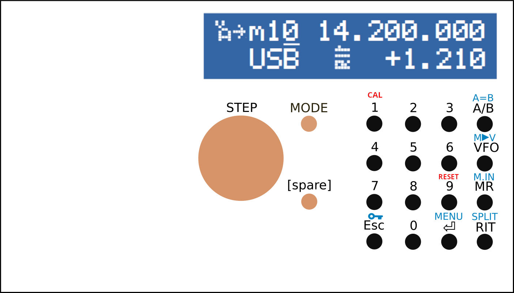

This is an **evolution of the [Smart-VFO](https://github.com/fcisotta/smart-vfo) project**, specialized for **single-band RTX operations**.

While one band only is supported, this allowed featuring complete band configuration at runtime (band limits, along with conversion design, power levels, etc. may be set in the calibration menu, with the front-end controls). Thus, no coding is required to set up firmware for the RTX project.

All standard features of the Smart-VFO are maintained in this version, including the A/B VFO duality and memory channels amount.

`BAND_UP` and `BAND_DN` buttons are spared, since they become useless in this application, while their role at boot time (opening calibration menu and triggering factory reset) have been reassigned to keypad buttons `1` and `9`, respectively.

Please refer to the multi-band [Smart-VFO](https://github.com/fcisotta/smart-vfo) project for any further detail.

 

# User Interface controls

&nbsp; &nbsp; &nbsp; &nbsp; &nbsp; &nbsp; &nbsp; &nbsp; 

Blue-labeled button functions may be activated by a long press (> 1 s).

Red-labeled button functions are enforced at boot time.

 

# Contributions and future updates
Please feel free to report issues and submit pull requests with improvements and new features, and stay tuned for fixes and updates!

[Giovanni Caracuta (I7IWN)](mailto:g.caracuta@libero.it) and [Francesco Cisotta (IZ2QPV)](mailto:francesco@cisotta.com)

