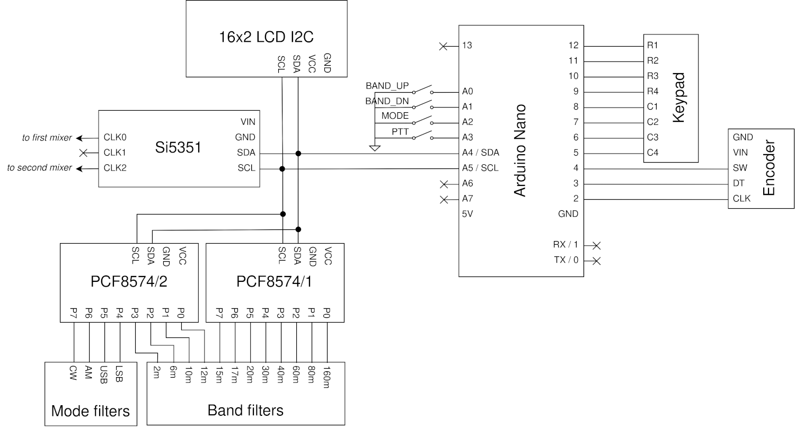
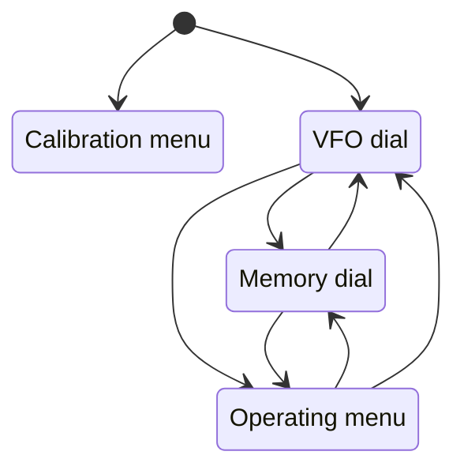
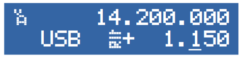
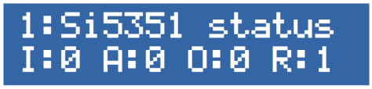

This is a flexible multi-band VFO firmware running on the Arduino platform, driving a Skyworks (formerly SiliconLabs) [Si5351](https://www.skyworksinc.com/-/media/Skyworks/SL/documents/public/data-sheets/Si5351-B.pdf) DDS.

This work started from the Multifeatured VFO project by [Jason Milldrum (NT7S)](mailto:milldrum@gmail.com) and [Przemek Sadowski (SQ9NJE)](https://sq9nje.pl/), and moved to the goal of implementing a set of features generally available in commercial-grade transceivers, while keeping focus on performance and maintainability.

It relies on
- [Jason Milldrum (NT7S)](mailto:milldrum@gmail.com)'s [Etherkit_Si5351 library](https://github.com/etherkit/Si5351Arduino), to drive the Si5351 DDS module,
- [Ben Buxton](mailto:bb@cactii.net)'s [Rotary library](https://github.com/buxtronix/arduino/tree/master/libraries/Rotary), to control a rotary encoder,
- Frank de Brabander's [LiquidCrystal_I2C library](https://github.com/marcoschwartz/LiquidCrystal_I2C), to drive a I2C LCD display.

This project is licensed under the terms of the [GNU General Public License v3.0](LICENSE.txt).

Initial authors: [Giovanni Caracuta (I7IWN)](mailto:g.caracuta@libero.it) and [Francesco Cisotta (IZ2QPV)](mailto:francesco@cisotta.com).

 

# Table of contents

<!--ts-->
   * [Hardware requirements](#hardware-requirements)
   * [Circuit connections](#circuit-connections)
   * [User Interface controls](#user-interface-controls)
   * [Build control](#build-control)
   * [Operation information](#operation-information)
   * [Operation workflow](#operation-workflow)
      * [Calibration menu](#calibration-menu)
      * [VFO Dial](#vfo-dial)
      * [Memory Dial](#memory-dial)
      * [Operating menu](#operating-menu)
   * [Contributions and future updates](#contributions-and-future-updates)
<!--te-->

 

# Hardware requirements

| Component           | Description | Datasheet     |
|---------------------|-------------|---------------|
| Arduino Nano board       | This firmware is designed to run on an Arduino Nano board (any version). It supports Arduino Uno as well, though with minor adjustment to cope with the fewer ports available. | [Arduino Nano](https://docs.arduino.cc/hardware/nano)   |
| Si5351 module       | A DDS in the Si5351 series of clock generator ICs from Skyworks (formerly SiliconLabs) | [Si5351](https://www.skyworksinc.com/-/media/Skyworks/SL/documents/public/data-sheets/Si5351-B.pdf) |
| Two PCF8574 modules | I2C modules to serialize control of a number of parallel output signals. | [TI PCF8574](https://www.ti.com/lit/ds/symlink/pcf8574.pdf?ts=1686475889967&ref_url=https%253A%252F%252Fwww.ti.com%252Fproduct%252FPCF8574) |

Other components are outlined in the circuit schematic below.

 

# Circuit connections

### PCF8574 configuration

| module    | I2C address |
|-----------|:-----------:|
| PCF8574/1 | 32          |
| PCF8574/2 | 33          |

 

# User Interface controls

&nbsp; &nbsp; &nbsp; &nbsp; &nbsp; &nbsp; &nbsp; &nbsp; 

Functions labelled in blue over buttons may be activated by a long press (> 1 s).

 

# Build control
### Library dependencies

| Library           | Author              | Description     |
|-------------------|---------------------|-----------------|
| [Etherkit_Si5351](https://github.com/etherkit/Si5351Arduino) 1   | [Jason Milldrum (NT7S)](mailto:milldrum@gmail.com) | Driving the Si5351 DDS |
| [Rotary](https://github.com/buxtronix/arduino/tree/master/libraries/Rotary) | [Ben Buxton](mailto:bb@cactii.net) | Controlling a rotary encoder |
| [LiquidCrystal_I2C](https://github.com/marcoschwartz/LiquidCrystal_I2C)     | Frank de Brabander (maintainer [Marco Schwartz](mailto:marcolivier.schwartz@gmail.com)) | Driving a I2C display |

The adopted version of each library is bundled with the firmware, for ease of build.

> [!NOTE]
> 1 The following **patch** is applied on the embedded **Etherkit library** code, in order to succesfully set a new PLL freq after crossing the SI5351_MULTISYNTH_MAX_FREQ threshold downwards:
> in the `uint8_t Si5351::set_freq(uint64_t freq, enum si5351_clock clk)` method, at line 314, the call to pll_reset() is uncommented.

 

# Operation information

The firmware may drive frequency synthesis according to the transceiver design, among the following:
- Direct conversion
- Single conversion
- Freq x 4

You configure the hardware design, along with other design parameters, in the [Calibration menu](#calibration-menu).

Whichever the design is, the following band limits are pre-configured, matching [IARU/ITU bandplan](https://www.iaru.org/on-the-air/band-plans/) for Region 1.

> [!CAUTION]
> *You are required to **amend frequency constraints according to current regulations** at the time of operation, or when a different Region applies. (For this purpose, update band limits in `smart-vfo.ino` at line 282, and adjust default entry frequencies accordingly in `memory.ino` at line 266. Finally increase EEPROM_DATAMODEL_VERSION in `smart-vfo.ino` at line 298, for changes to apply.)*

| Band   | Lower limit      | Upper limit    | Default entry frequency | Default mode  |
|:------:|-----------------:|---------------:|------------------------:|:-------------:|
| 160m   |  1.800.000 Hz    |  1.860.000 Hz  |  1.840.000 Hz           | LSB           |
| 80m    |  3.500.000 Hz    |  3.800.000 Hz  |  3.650.000 Hz           | LSB           |
| 60m    |  5.300.000 Hz    |  5.380.000 Hz  |  5.360.000 Hz           | LSB           |
| 40m    |  6.995.000 Hz    |  7.250.000 Hz  |  7.100.000 Hz           | LSB           |
| 30m    | 10.100.000 Hz    | 10.150.000 Hz  | 10.130.000 Hz           | USB           |
| 20m    | 13.995.000 Hz    | 14.500.000 Hz  | 14.200.000 Hz           | USB           |
| 17m    | 18.050.000 Hz    | 18.200.000 Hz  | 18.120.000 Hz           | USB           |
| 15m    | 20.995.000 Hz    | 21.500.000 Hz  | 21.200.000 Hz           | USB           |
| 12m    | 24.850.000 Hz    | 25.000.000 Hz  | 24.940.000 Hz           | USB           |
| 10m    | 28.000.000 Hz    | 30.000.000 Hz  | 28.950.000 Hz           | USB           |
|  6m    | 50.000.000 Hz    | 52.000.000 Hz  | 50.100.000 Hz           | USB           |
|  2m    | 144.000.000 Hz   | 146.000.000 Hz | 144.500.000 Hz          | USB           |

Two independent VFO tuners (VA and VB) and 40 memory channels are available, persisting each:

| Tuning parameter | Range                |
|------------------|----------------------|
| TX frequency     | Relevant band limits |
| Modulation mode  | LSB, USB, AM, CW     |
| RIT offset       | ± 5.000 Hz           |

VFO tuners persist individual operating data for each band.

 

# Operation workflow
During an operating session, the user moves around the following operating states, which are described in the sections below.

At boot time, the firmware enters the [VFO dial](#vfo-dial) state, where tuning is allowed on either of the two VFOs.

- Keep the `BAND UP` button pressed at boot time to step into the [Calibration menu](#calibration-menu).

- If the `BAND DN` button is pressed at boot time, the factory default configuration is restored into EEPROM (all user data and settings are lost!).

 

## Calibration menu

The display shows the available configuration items on the first line, and editable values on the second one.

The following settings may be customized under this menu.
They are persisted into the EEPROM, and may always be reset to factory defaults as described in the section above.

| Setting         | Description                                                                | Range                  | Factory default  |
|-----------------|----------------------------------------------------------------------------|------------------------|------------------|
| Design          | Controlled transceiver design                                              | \[Single conversion, direct conversion, Freq x 4\]         | Single conversion        |
| IF              | Intermediate Frequency value to result out of the first mixer *(applies to Single conversion design only)*              | 10 Hz - 90 MHz         | 9.999 KHz        |
| Conversion      | Whether first mixed should be fed with sum or difference between RF and IF *(applies to Single conversion design only)* | \[LO=IF+RF, LO=IF-RF\] | LO=IF+RF         |
| SSB offset      | IF offset for SSB modulation *(applies to Single conversion design only)*                                               | 10 - 10.000 Hz         | 1.500 Hz         |
| CW offset       | IF offset for CW modulation *(applies to Single conversion design only)*                                                | 10 - 10.000 Hz         | 800 Hz           |
| DDS calibration | Frequency correction value for Si5351 (in Hz units)                        | -9.000 - 9.000 Hz      | 0 Hz             |
| CLK0 power      | Si5351 power level at CLK0 output                                          | 2 - 8 mA current out   | 8 mA             |
| CLK2 power      | Si5351 power level at CLK2 output *(applies to Single conversion design only)*                                          | 2 - 8 mA current out   | 8 mA             |

DDS calibration is allowed at runtime, since the Si5351 is powered and CLK0 set to a reference frequency of 10,000 MHz while editing the correction factor. Please tune this parameter until the output measured on CLK0 is as close to 10 MHz as possible. Then press `ENTER`.

### Features
- Menu is navigated through the `ENTER`, `ESC` buttons and `DIAL` control to rotate values.
- The `STEP` button allows modifying the step of increments of the DIAL control over numeric values.

 

## VFO Dial

The display shows current VFO and tuned frequency, active modulation mode and possible RIT.

During operation, other flags are displayed to report for active features.

### Features
- With `DIAL` control you may rotate frequency (step may be adjusted with STEP button).
- By pressing `ENTER`, direct frequency entry mode is initiated. Type frequency with the digit buttons or press `ESC` to quit. Frequency is accepted and tuned as soon as the last digit is entered. Current VFO automatically switches to the band matching the frequency entered.
- When `RIT` button is pressed, DIAL control focus is moved to the RIT value. An independent RIT rotation step may be now adjusted with the `STEP` button. 
- The `MODE` button allows rotation among the supported modulation modes.
- The `SPLIT` button activates the SPLIT mode, which switches to the frequency and mode of the opposite VFO during TX operation.
- The `A/B` button allows switching between the two available VFO tuners.
- The `A=B` function overwrites the opposite VFO record for current band with operating values of current VFO.
- The `M.IN` (memory input) function allows storing current VFO record into a memory channel. When activating this function, the target memory channel must be selected with the DIAL control. Non-empty channels are marked with a full circle symbol (●).
- The `LOCK` function inhibits any control on the UI, allowing only RX|TX switching.

- The `MR` (memory recall) button switches into the [Memory Dial](#memory-dial) state.
- The `MENU` function opens the [Operating menu](#operating-menu).

 

## Memory Dial

The display shows current memory channel, along with its frequency, mode and possible RIT currently tuned.

During operation, other flags are displayed to report for active features.

### Features
- With `DIAL` control you may rotate among populated memory channels.
- By pressing `ENTER`, direct channel entry mode is initiated. Type channel with the digit buttons or press `ESC` to quit. Channel is accepted and tuned as soon as the last digit is entered. Modulation mode and RIT value cannot be adjusted while in the memory browsing state. To apply an adjustment, shift the memory channel record to a VFO tuner, as described in the point below. 
- The `M🞂V` function allows shifting current memory channel to current VFO, overwriting the matching band record. With this action, [VFO dial](#vfo-dial) state is stepped back into.
- The `LOCK` function inhibits any control on the UI, allowing only RX|TX switching.

- The `VFO` button switches into the [VFO Dial](#vfo-dial) state.
- The `MENU` function opens the [Operating menu](#operating-menu).

 

## Operating menu

The display shows the available configuration items on the first line, and editable values on the second one.

The following settings may be customized under this menu.
They are persisted into the EEPROM, and may always be reset to factory defaults as described in the section above.

| Setting       | Description                                                 | Range    | Factory default | Comments   |
|---------------|-------------------------------------------------------------|----------|-----------------|------------|
| Sound         | Whether sound is produced while completing selected actions | OFF, ON  | ON              | This menu item is unavailable from v0.9.5, with sound feature removed in favour of the new 2m band (see CHANGELOG). | 

The second to last menu item allows monitoring the Si5351 device status, through the following runtime params (refer to Etherkit release notes for their meaning):

| Param    | Symbol on display |
|----------|-------------------|
| SYS_INIT | I                 |
| LOL_A    | A                 |
| LOS      | O                 |
| REVID    | R                 |

The last menu item shows current firmware version and date of release.

### Features
- Menu is navigated through the `ENTER`, `ESC` buttons and `DIAL` control to rotate values.
- The `STEP` button allows modifying the step of increments of the DIAL control over numeric values.

 

# Contributions and future updates
Please feel free to report issues and submit pull requests with improvements and new features, and stay tuned for fixes and updates!

[Giovanni Caracuta (I7IWN)](mailto:g.caracuta@libero.it) and [Francesco Cisotta (IZ2QPV)](mailto:francesco@cisotta.com)

